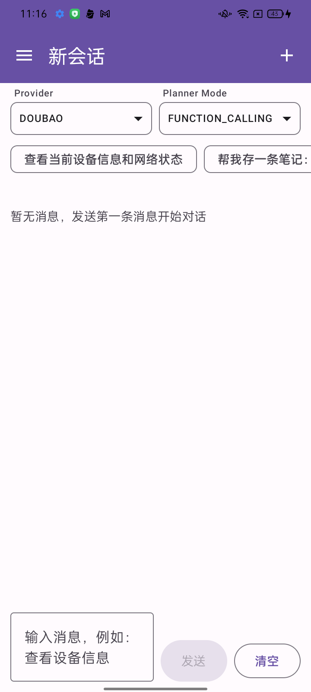
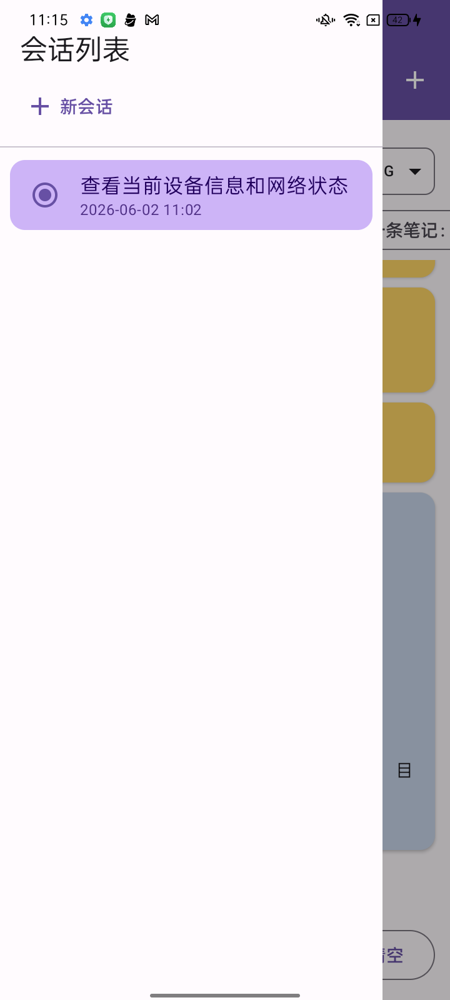
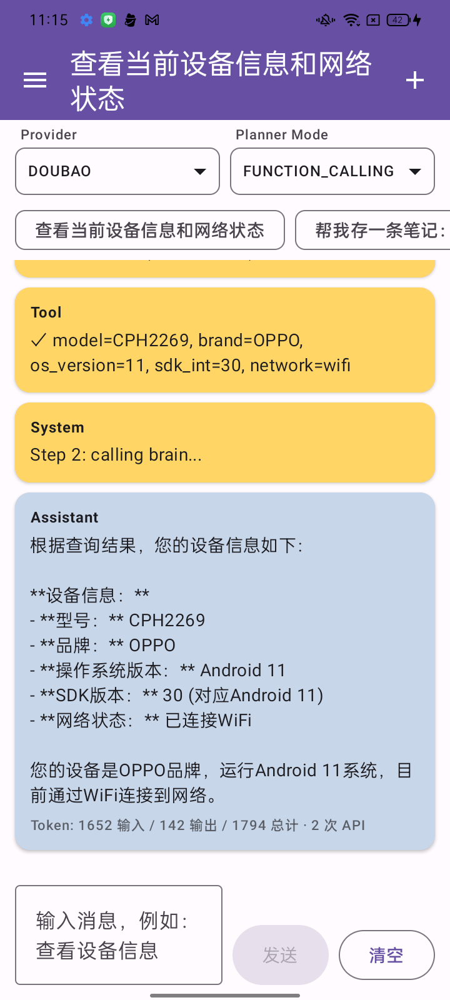

# Easy Agent SDK

一个轻量、原生、可扩展的 **Android AI Agent 开发框架**。V1 支持在线 LLM（OpenAI / 通义千问 / 豆包），Planner 支持 Function Calling 与 ReAct 两种模式，内置常用设备 Tool，架构预留离线模型与长期记忆扩展。

### 开发方式与人机协作

本仓库在 **AI 辅助编程（Vibe Coding）** 下完成：需求澄清、设计规格、任务拆解与实现迭代，主要由人与 AI 编程助手协作完成；源码与 `docs/` 中的文档共同构成可复现的协作记录。

若希望了解「从想法到可运行 Demo」的过程，可按下列顺序阅读 `docs/`（由粗到细）：

| 文档 | 作用 |
|------|------|
| [`docs/superpowers/specs/2026-05-29-android-easy-agent-design.md`](docs/superpowers/specs/2026-05-29-android-easy-agent-design.md) | V1 设计规格：目标、范围、架构与模块划分（人机对齐的「契约」） |
| [`docs/superpowers/plans/2026-05-29-android-easy-agent.md`](docs/superpowers/plans/2026-05-29-android-easy-agent.md) | 分步实现计划：Gradle 骨架 → Core → Memory/Tools/Brain/Planner → Demo |
| [`docs/module-responsibility-boundaries.md`](docs/module-responsibility-boundaries.md) | SDK（`easy-agent`）与 Demo（`app`）职责边界，扩展时判断代码落点 |
| [`docs/vibecoding-handoff.md`](docs/vibecoding-handoff.md) | 交接与演进摘要：换机/新会话恢复上下文，含已实现功能与约定 |

典型协作链路可概括为：

```text
人：提出目标与约束 → AI：整理设计规格
人：审阅/批准规格   → AI：拆解实现计划并逐步落代码
人：验收、纠偏      → AI：更新 handoff / 边界文档，便于下一轮会话接续
```

换机或隔较长时间继续开发时，可在 AI 编程环境中引用 `docs/vibecoding-handoff.md` 与 `docs/module-responsibility-boundaries.md` 恢复上下文（详见 handoff 文档）。  
**说明**：聊天历史默认不随仓库同步；`docs/` 是仓库内可版本化、可反推协作过程的主要依据。

[English](#english) | [中文](#中文)

---

## 中文

### 架构

```
┌─────────────────────────────────────┐
│  Agent 入口（EasyAgent）             │   对外唯一入口
├─────────────────────────────────────┤
│  大脑模块（Brain）                   │   LLM 决策中心
├─────────────────────────────────────┤
│  记忆模块（Memory）                  │   短期记忆（可扩展长期记忆）
├─────────────────────────────────────┤
│  规划模块（Planner）                 │   任务拆解、步骤执行
├─────────────────────────────────────┤
│  工具模块（Tools）                   │   手机能力 + 外部 API
└─────────────────────────────────────┘
```

### 特性

- **轻量**：单 module SDK，依赖少（Coroutines + OkHttp + Serialization）
- **原生**：纯 Android/Kotlin，minSdk 24
- **可扩展**：Memory / Planner / Tools / Brain 均为接口，可插拔
- **双模式 Planner**：Function Calling（默认）与 ReAct，用户可选
- **三家在线 API**：OpenAI、通义千问（OpenAI 兼容）、豆包（Responses API）
- **Java 互操作**：提供 `EasyAgentJavaBridge`

### 技术栈与环境

| 层级 | 技术 | 说明 |
|------|------|------|
| **SDK**（`easy-agent`） | Kotlin · Coroutines · OkHttp · kotlinx.serialization | 纯逻辑库，无 UI 依赖 |
| **Demo**（`app`） | Kotlin · Jetpack Compose · Material3 · Room · ViewModel | Compose 聊天 UI，Room 持久化会话与消息 |
| **构建** | AGP **8.7.2** · Gradle **8.9** · Kotlin **2.0.21** · KSP **2.0.21-1.0.28** | 版本锁定于 `gradle/libs.versions.toml` |
| **Android** | compileSdk **35** · minSdk **24** · targetSdk **35** · JVM **17** | 需 JDK 17+；建议使用 Android Studio Ladybug 或更新版本 |

> **版本约束**：请使用 AGP ≥ 8.7 且 Gradle ≥ 8.9；Kotlin 需与 Compose Compiler 插件版本一致（当前 **2.0.21**）。Compose 依赖由 BOM **2024.10.01** 对齐；Room **2.6.1**。自行升级 AGP/Kotlin 时请先 Sync 验证，避免与 KSP / Compose 插件不兼容。

### 快速开始

#### 1. 引入模块

```kotlin
// settings.gradle.kts
include(":easy-agent")

// app/build.gradle.kts
dependencies {
    implementation(project(":easy-agent"))
}
```

#### 2. 最小示例

```kotlin
import com.easyagent.EasyAgent
import com.easyagent.brain.BrainConfig
import com.easyagent.brain.BrainProvider
import com.easyagent.planner.PlannerMode
import androidx.lifecycle.lifecycleScope
import kotlinx.coroutines.launch

val agent = EasyAgent.Builder(context)
    .brainConfig(
        BrainConfig(
            provider = BrainProvider.QWEN,
            apiKey = "your-api-key",
            model = "qwen-plus"
        )
    )
    .plannerMode(PlannerMode.FUNCTION_CALLING) // 或 REACT
    .build()

lifecycleScope.launch {
    val response = agent.chat("查看设备信息和网络状态")
    Log.d("Agent", response.content)
}
```

#### 3. 流式事件

```kotlin
import com.easyagent.core.AgentEvent
import androidx.lifecycle.lifecycleScope
import kotlinx.coroutines.launch

lifecycleScope.launch {
    agent.chatStream("帮我存一条笔记").collect { event ->
        when (event) {
            is AgentEvent.ToolCallStarted -> { /* 展示 Tool 调用 */ }
            is AgentEvent.TextDelta -> { /* 打字机增量文本 */ }
            is AgentEvent.Completed -> { /* event.response 为最终回复 */ }
            is AgentEvent.Error -> { /* event.exception */ }
            else -> Unit
        }
    }
}
```

#### 4. 注册自定义 Tool

```kotlin
import com.easyagent.core.JsonProperty
import com.easyagent.core.JsonSchema
import com.easyagent.tools.AgentTool
import com.easyagent.tools.ToolResult

class MyTool : AgentTool {
    override val name = "my_tool"
    override val description = "Does something useful"
    override val parameters = JsonSchema(
        properties = mapOf("input" to JsonProperty(type = "string")),
        required = listOf("input")
    )

    override suspend fun execute(args: Map<String, Any>): ToolResult {
        return ToolResult.ok("result")
    }
}

// 方式一：构建时注册
val agent = EasyAgent.Builder(context)
    .brainConfig(/* ... */)
    .addTool(MyTool())
    .build()

// 方式二：构建后注册
agent.registerTool(MyTool())
```

### 内置 Tools（V1）

| Tool | 说明 |
|------|------|
| `device_info` | 设备型号、系统版本、网络状态 |
| `system_action` | 打开 URL、分享文本、Toast |
| `local_storage` | SharedPreferences KV 读写 |
| `http_request` | HTTP GET/POST 请求 |

### Brain 配置

| Provider | 默认 Base URL | 模型示例 |
|----------|---------------|----------|
| `OPENAI` | `https://api.openai.com/v1` | `gpt-4o-mini` |
| `QWEN` | `https://dashscope.aliyuncs.com/compatible-mode/v1` | `qwen-plus` |
| `DOUBAO` | `https://ark.cn-beijing.volces.com/api/v3` | `deepseek-v3-2-251201` 或 `ep-xxx` |

> **豆包特别注意**：V1 使用火山方舟 [Responses API](https://www.volcengine.com/docs/82379/1585128?lang=zh)（非 Chat Completions）。`model` 填模型 ID 或推理接入点 ID，API Key 使用 `ARK_API_KEY`。详见 [快速入门](https://www.volcengine.com/docs/82379/1399008?lang=zh)。

```kotlin
// 豆包示例（Responses API）
BrainConfig(
    provider = BrainProvider.DOUBAO,
    apiKey = "your-ark-api-key",
    model = "deepseek-v3-2-251201"  // 或 ep-2024xxxxxx-xxxxx
)
```

```kotlin
BrainConfig(
    provider = BrainProvider.OPENAI,
    apiKey = "sk-...",
    model = "gpt-4o-mini",
    baseUrl = null,       // 可选自定义端点
    timeoutMs = 60_000
)
```

### EasyAgent Builder 配置项

| 方法 | 说明 | 默认值 |
|------|------|--------|
| `brainConfig()` | Brain 配置（必填） | — |
| `plannerMode()` | `FUNCTION_CALLING` / `REACT` | `FUNCTION_CALLING` |
| `memory()` | 自定义 Memory 实现 | 内存短期记忆 |
| `maxSteps()` | Planner 最大步数 | `10` |
| `systemPrompt()` | 系统提示词 | 内置默认 |
| `contextLimit()` | 上下文消息条数 | `20` |
| `temperature()` | 采样温度 | `0.7` |
| `addTool()` | 注册额外 Tool | — |

### 运行 Demo

在 Android Studio 中打开项目并 **Sync Project with Gradle Files**，运行 `app` 模块即可。

若已生成 Gradle Wrapper，也可在终端执行：

```bash
./gradlew :app:assembleDebug
```

安装 `app` 模块，在 `local.properties` 中配置 API Key（或运行时手动输入），选择 Provider 和 Planner Mode，即可体验聊天与 Tool 调用过程。

#### Demo 界面：新会话与历史会话

Demo 使用 **Compose + Room**：侧栏管理会话列表；「新会话」为草稿态（首条消息发送后才写入 Room），历史会话可切换并恢复聊天记录。

| 新会话（草稿） | 会话列表（切换历史） | 历史会话（恢复对话） |
|:---:|:---:|:---:|
|  |  |  |
| 标题「新会话」，空态提示 | 侧栏列出已保存会话，单选切换 | 切换后恢复该会话消息与 Tool 轨迹 |

#### Demo API Key 配置

复制 `local.properties.example` 中的 Key 项到项目根目录 `local.properties` 并填写：

```properties
EASY_AGENT_OPENAI_API_KEY=sk-...
EASY_AGENT_QWEN_API_KEY=sk-...
EASY_AGENT_DOUBAO_API_KEY=your-ark-api-key
```

Gradle 打包时读取上述属性，注入 `BuildConfig.OPENAI_API_KEY` / `QWEN_API_KEY` / `DOUBAO_API_KEY`；运行时 Demo 优先使用界面输入，为空则回退 BuildConfig。

### 扩展指南

**自定义 Memory（V2 长期记忆）**

```kotlin
import com.easyagent.core.Message
import com.easyagent.memory.Memory

class SqliteMemory : Memory {
    override fun add(message: Message) { /* ... */ }
    override fun getContext(limit: Int): List<Message> { /* ... */ }
    override fun clear() { /* ... */ }
}

EasyAgent.Builder(context)
    .brainConfig(/* ... */)
    .memory(SqliteMemory())
    .build()
```

**自定义 Brain（V2 离线模型）**

实现 `Brain` 接口，在 `BrainFactory` 中注册新 Provider 即可。

**自定义 Planner**

实现 `Planner` 接口，通过 `PlannerFactory` 扩展新模式。

### 项目结构

```
EasyAgent/               # 项目根目录
├── easy-agent/          # SDK library（Kotlin）
├── app/                 # Demo App（Compose + Room）
├── docs/
│   ├── superpowers/     # 设计规格与实现计划（协作起点）
│   ├── vibecoding-handoff.md
│   ├── module-responsibility-boundaries.md
│   └── screenshots/     # Demo 界面截图
└── README.md
```

### Roadmap

- [x] V1：在线 Agent 闭环 + Demo + 开源 README
- [ ] V2：TFLite / ONNX / Llama.cpp 离线 Brain
- [ ] V2：长期记忆（SQLite + 向量检索）
- [ ] ToolPack 插件化

### License

Apache License 2.0 — 见 [LICENSE](LICENSE)

---

## English

### Overview

**Easy Agent SDK** is a lightweight, native, extensible Android AI Agent framework. V1 delivers an online agent loop with OpenAI / Qwen / Doubao APIs, dual planner modes (Function Calling & ReAct), and built-in device tools.

### Built with AI-assisted development

This repository was developed through **human–AI pair programming** (Vibe Coding). The collaboration trail—design spec, implementation plan, module boundaries, and handoff notes—lives under [`docs/`](docs/). Start with the design spec and plan under `docs/superpowers/`, then read `module-responsibility-boundaries.md` and `vibecoding-handoff.md` for architecture decisions and iteration history. Chat history is not versioned with the repo; `docs/` is the primary way to reconstruct how the project was built.

**Stack**: Kotlin SDK + Compose/Room demo app. Build with AGP **8.7.2**, Gradle **8.9**, Kotlin **2.0.21**, JDK **17**, compileSdk **35**, minSdk **24** (see `gradle/libs.versions.toml`).

### Quick Start

```kotlin
import com.easyagent.EasyAgent
import com.easyagent.brain.BrainConfig
import com.easyagent.brain.BrainProvider
import com.easyagent.planner.PlannerMode
import androidx.lifecycle.lifecycleScope
import kotlinx.coroutines.launch

val agent = EasyAgent.Builder(context)
    .brainConfig(
        BrainConfig(
            provider = BrainProvider.OPENAI,
            apiKey = "api-key",
            model = "gpt-4o-mini"
        )
    )
    .plannerMode(PlannerMode.FUNCTION_CALLING)
    .build()

lifecycleScope.launch {
    val response = agent.chat("What's my device info?")
    Log.d("Agent", response.content)
}
```

See the Chinese section above for full API docs, built-in tools, and extension guides.

### License

Apache License 2.0
